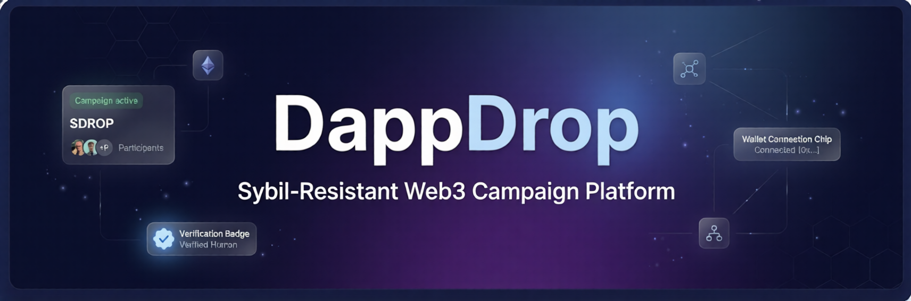

<p align="center">
  
</p>

<h1 align="center">DappDrop</h1>

<p align="center">
  <strong>The Sybil-Resistant Web3 Campaign Platform for Community Building</strong>
</p>

<p align="center">
  <a href="#features">Features</a> •
  <a href="#architecture">Architecture</a> •
  <a href="#tech-stack">Tech Stack</a> •
  <a href="#getting-started">Getting Started</a> •
  <a href="#deployment">Deployment</a> •
  <a href="#documentation">Docs</a>
</p>

<p align="center">
  
  
  
  
  
</p>

---

## Overview

**DappDrop** is a full-stack Web3 platform that enables project teams to launch airdrop campaigns, engage real users through verified tasks, and distribute token rewards — all while preventing Sybil attacks through [Humanity Protocol](https://humanity.org) biometric verification.

Unlike traditional airdrop platforms plagued by bots and multi-account farming, DappDrop uses a hybrid on-chain/off-chain architecture where campaign logic and rewards live on Ethereum smart contracts, while social verification, analytics, and media are handled off-chain for speed and cost efficiency.

**Ditch the bots. Find your tribe.**

---

## Features

### 🛡️ Sybil-Resistant Verification

- **Humanity Protocol OAuth** — Palm biometric scanning via the `@humanity-org/react-sdk`
- **Configurable Presets** — Choose from `is_human`, `palm_verified`, or `kyc_passed` per task
- **24-Hour Caching** — Verification results cached server-side to avoid repeated checks
- **Rate Limiting** — Built-in protection against verification abuse

### 🔗 On-Chain Campaign Engine

- **Smart Contract Backend** — Campaigns, tasks, and rewards managed by Solidity contracts on Ethereum
- **ERC-20 & ERC-721 Rewards** — Distribute fungible tokens or NFTs to verified participants
- **Role-Based Access** — Separate Host (campaign creator) and Participant flows
- **Campaign Lifecycle** — Draft → Open → Ended states with host controls

### ✅ Multi-Platform Task Verification

| Task Type                 | Verification Method                                          |
| ------------------------- | ------------------------------------------------------------ |
| **Discord**               | Bot membership check + OAuth verification                    |
| **Telegram**              | Bot API member verification                                  |
| **Twitter/X**             | Social follow verification                                   |
| **On-Chain Payment**      | Transaction hash scanning across ETH, Base, Polygon, Sepolia |
| **Humanity Verification** | Biometric palm scan via Humanity Protocol                    |

### 🤖 AI-Powered Campaign Builder

- **Gemini AI Integration** — Generate campaign titles, descriptions, and task structures from a prompt
- **Structured Output** — AI produces ready-to-use campaign configurations

### 📊 Host Dashboard & Analytics

- **Campaign Statistics** — Total campaigns, active campaigns, total participants at a glance
- **Participant Analytics** — Per-participant task completion tracking and reward claim status
- **Real-Time Refresh** — Pull latest data from blockchain with one click

### 🖼️ Campaign Media

- **UploadThing Integration** — Drag-and-drop image uploads for campaign banners
- **Automatic Cleanup** — Orphaned images cleaned up when campaigns are updated
- **Wallet Signature Auth** — Secure upload authorization via wallet signatures

### ⚡ Performance Optimized

- **Turbopack** — Lightning-fast dev server with `next dev --turbopack`
- **Dynamic Imports** — Heavy components (modals, analytics) lazy-loaded on demand
- **Optimized Package Imports** — Tree-shaken Radix UI, Lucide, ethers, and more
- **Parallelized Data Fetching** — Independent blockchain calls run concurrently
- **Server Components** — Marketing pages use Next.js Server Components for zero-JS delivery

---

## Architecture

```text
┌─────────────────────────────────────────────────────────────────┐
│                        FRONTEND (Next.js 15)                     │
│                                                                  │
│  ┌──────────────┐  ┌──────────────┐  ┌───────────────────────┐  │
│  │  Marketing   │  │   App Pages  │  │    API Routes         │  │
│  │  (SSR)       │  │  (Client)    │  │  /api/verify-task     │  │
│  │  Landing     │  │  Dashboard   │  │  /api/verify-humanity │  │
│  │  About       │  │  Campaigns   │  │  /api/campaigns       │  │
│  │  Changelog   │  │  Create      │  │  /api/uploadthing     │  │
│  └──────────────┘  └──────┬───────┘  └───────────┬───────────┘  │
│                           │                       │              │
└───────────────────────────┼───────────────────────┼──────────────┘
                            │                       │
              ┌─────────────▼──────────┐  ┌────────▼─────────────┐
              │   Ethereum (Sepolia)   │  │   PostgreSQL (Neon)  │
              │                        │  │                      │
              │  Campaign Factory      │  │  Users               │
              │  ├─ createCampaign()   │  │  CampaignCache       │
              │  ├─ completeTask()     │  │  CampaignTaskMeta    │
              │  ├─ claimReward()      │  │  SocialVerification  │
              │  └─ endCampaign()      │  │  PaymentVerification │
              └────────────────────────┘  │  Analytics           │
                                          └──────────────────────┘
                            │
              ┌─────────────▼──────────────────┐
              │       External Services        │
              │                                │
              │  Humanity Protocol (OAuth SDK)  │
              │  Discord Bot API               │
              │  Telegram Bot API              │
              │  UploadThing (Image CDN)       │
              │  Google Gemini (AI)            │
              └────────────────────────────────┘
```

**Key Design Decisions:**

- **On-chain**: Campaign creation, task completion, reward distribution, participation records
- **Off-chain**: Social verification proofs, campaign images, metadata caching, analytics
- **Hybrid**: Task status checked via smart contract view functions for performance, with DB cache as fallback

---

## Tech Stack

| Category        | Technology                                           |
| --------------- | ---------------------------------------------------- |
| **Framework**   | Next.js 15 (App Router, Turbopack)                   |
| **Language**    | TypeScript                                           |
| **Styling**     | Tailwind CSS + Radix UI + shadcn/ui                  |
| **Animations**  | Framer Motion                                        |
| **Blockchain**  | Ethers.js, Viem, Wagmi v2                            |
| **Wallet**      | RainbowKit (MetaMask, WalletConnect, Coinbase, etc.) |
| **Database**    | PostgreSQL (Neon) + Prisma ORM                       |
| **Auth**        | NextAuth.js (Discord OAuth) + Wallet Signatures      |
| **Identity**    | Humanity Protocol React SDK                          |
| **AI**          | Google Gemini (via Vercel AI SDK)                    |
| **File Upload** | UploadThing                                          |
| **Forms**       | React Hook Form + Zod validation                     |
| **Deployment**  | Vercel                                               |

---

## Getting Started

### Prerequisites

- **Node.js** ≥ 18
- **npm** or **yarn**
- **PostgreSQL** database (or [Neon](https://neon.tech) serverless Postgres)
- **MetaMask** or any EVM-compatible wallet
- A deployed `Web3Campaigns` smart contract on Sepolia

### 1. Clone & Install

```bash
git clone https://github.com/DheerajShrivastav/DappDrop-FrontEnd.git
cd DappDrop-FrontEnd
npm install
```

### 2. Configure Environment

```bash
cp .env.example .env.local
```

Fill in all required values (see [Environment Variables](#environment-variables) below).

### 3. Set Up Database

```bash
npx prisma generate    # Generate Prisma client
npx prisma migrate dev # Run migrations (new DB)
```

### 4. Run Development Server

```bash
npm run dev
```

Open [http://localhost:3000](http://localhost:3000) — you'll need a wallet connected to the **Sepolia testnet**.

---

## Environment Variables

| Variable                                | Required | Description                                                             |
| --------------------------------------- | -------- | ----------------------------------------------------------------------- |
| **Database**                            |          |                                                                         |
| `DATABASE_URL`                          | ✅       | PostgreSQL connection string                                            |
| **Blockchain**                          |          |                                                                         |
| `NEXT_PUBLIC_CAMPAIGN_FACTORY_CONTRACT` | ✅       | Deployed smart contract address (Sepolia)                               |
| `NEXT_PUBLIC_SEPOLIA_RPC_URL`           | ✅       | Sepolia RPC endpoint (Alchemy, Infura, or public)                       |
| `NEXT_PUBLIC_WALLETCONNECT_PROJECT_ID`  | ✅       | WalletConnect Cloud project ID                                          |
| **AI**                                  |          |                                                                         |
| `GEMINI_API_KEY`                        | ✅       | [Google AI Studio](https://aistudio.google.com/app/apikey) API key      |
| **Auth**                                |          |                                                                         |
| `NEXTAUTH_URL`                          | ✅       | Base URL (`http://localhost:3000` locally)                              |
| `NEXTAUTH_SECRET`                       | ✅       | Random secret for NextAuth session signing                              |
| **Discord**                             |          |                                                                         |
| `DISCORD_CLIENT_ID`                     | ⚙️       | Discord application client ID                                           |
| `DISCORD_CLIENT_SECRET`                 | ⚙️       | Discord application secret                                              |
| `DISCORD_BOT_TOKEN`                     | ⚙️       | Discord bot token for membership verification                           |
| `NEXT_PUBLIC_DISCORD_BOT_INVITE_URL`    | ⚙️       | Bot invite URL for campaign hosts                                       |
| **Telegram**                            |          |                                                                         |
| `TELEGRAM_BOT_TOKEN`                    | ⚙️       | Telegram bot token from [@BotFather](https://t.me/BotFather)            |
| `NEXT_PUBLIC_TELEGRAM_BOT_USERNAME`     | ⚙️       | Bot username (without @)                                                |
| **Humanity Protocol**                   |          |                                                                         |
| `NEXT_PUBLIC_HUMANITY_CLIENT_ID`        | ⚙️       | App ID from [Humanity Developer Portal](https://developer.humanity.org) |
| `NEXT_PUBLIC_HUMANITY_REDIRECT_URI`     | ⚙️       | OAuth callback URL (e.g. `https://your-domain.com/humanity-callback`)   |
| `NEXT_PUBLIC_HUMANITY_ENVIRONMENT`      | ⚙️       | `sandbox` or `production`                                               |
| **File Upload**                         |          |                                                                         |
| `UPLOADTHING_SECRET`                    | ⚙️       | UploadThing API secret                                                  |
| `UPLOADTHING_TOKEN`                     | ⚙️       | UploadThing app token                                                   |

> ✅ = Required for basic functionality &nbsp;&nbsp; ⚙️ = Required for specific features

---

## Deployment

### Vercel (Recommended)

1. Push your code to GitHub
2. Import the repository on [Vercel](https://vercel.com)
3. Add all environment variables in **Project Settings → Environment Variables**
4. Deploy

> **Important:** `NEXT_PUBLIC_*` variables are baked into the client bundle at build time. After adding or changing them, you must **redeploy** for changes to take effect.

> **Humanity Protocol:** Make sure to register your production redirect URI (`https://your-domain.vercel.app/humanity-callback`) in the [Humanity Developer Portal](https://developer.humanity.org).

---

## Project Structure

```text
src/
├── app/
│   ├── (marketing)/         # Landing page, about, changelog (SSR)
│   ├── (app)/               # Authenticated app pages
│   │   ├── campaign/[id]/   # Campaign detail + task verification
│   │   ├── campaigns/       # Campaign listing/discovery
│   │   ├── create-campaign/ # Multi-step campaign builder
│   │   ├── dashboard/       # Host dashboard & analytics
│   │   └── humanity-callback/ # Humanity OAuth redirect handler
│   └── api/                 # Next.js API routes
│       ├── verify-task/     # Social & on-chain task verification
│       ├── verify-humanity/ # Humanity Protocol server-side verification
│       ├── campaigns/       # Campaign CRUD operations
│       └── uploadthing/     # Image upload handler
├── components/              # Reusable UI components
├── context/                 # React context providers
│   ├── web3-provider.tsx    # RainbowKit + Wagmi + React Query
│   ├── wallet-provider.tsx  # Wallet state & role management
│   └── humanity-provider.tsx # Humanity Protocol SDK provider
├── lib/                     # Business logic & utilities
│   ├── web3-service.ts      # Blockchain interaction layer
│   ├── humanity-presets.ts  # Verification preset registry
│   ├── humanity-service.ts  # Humanity API service
│   └── verification-service.ts # Task verification backend
└── hooks/                   # Custom React hooks
```

---

## Documentation

Detailed docs are in the [`docs/`](./docs/) directory:

| Category                                 | Contents                                                         |
| ---------------------------------------- | ---------------------------------------------------------------- |
| [**Integrations**](./docs/integrations/) | Humanity Protocol, Discord, Telegram, UploadThing, Payment tasks |
| [**Architecture**](./docs/architecture/) | System design, security, image management, blueprint             |
| [**Guides**](./docs/guides/)             | API testing, verification workflows                              |

---

## Contributing

Contributions are welcome! Please:

1. Fork the repository
2. Create a feature branch (`git checkout -b feature/amazing-feature`)
3. Commit your changes (`git commit -m 'Add amazing feature'`)
4. Push to the branch (`git push origin feature/amazing-feature`)
5. Open a Pull Request

---

## License

This project is licensed under the **MIT License** — see the [LICENSE](./LICENSE) file for details.

---

<p align="center">
  Built with ❤️ for the Web3 community
</p>
